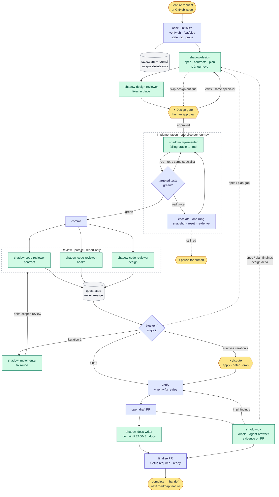

# Solodev

**Spec-driven development for coding agents.** Describe a feature, approve one design, and get back a reviewed, tested,
documented pull request, on [OpenCode](https://opencode.ai), [Cursor](https://cursor.com),
[Claude Code](https://code.claude.com), or [Codex](https://developers.openai.com/codex).

solodev installs a team of specialist agents (the shadows) and a small state CLI into your repo. A conductor agent,
`arise`, runs them through a fixed pipeline: design, critique, implement against failing tests, parallel review, QA,
docs, PR. You step in once, at the design gate.

Once installed, one command starts it all:

```text
/arise Add CSV export to the accounts page
```

## The name

solodev takes its name from the anime _Solo Leveling_, where one hunter commands an army of shadows that does the
fighting. It is the same shape here: you are the solo dev. One command, `/arise`, summons a team of shadows, specialist
agents (`shadow-design`, `shadow-implementer`, `shadow-qa`, and so on) that each do one job and report back to the
conductor. `quest-state` keeps the quest log, so any session knows where a feature stands. You give the order and
approve one design; the shadows return a reviewed, tested, documented pull request.

## Why

A single agent asked to "build feature X" tends to drift. It guesses at scope, writes tests that pass by construction,
reviews its own work, and loses track of where it was when the context runs out. solodev addresses this with structure:

- **One approved design.** A spec, `@S<n>`-tagged acceptance contracts, and a plan, written before any code and approved
  by you.
- **Test first, cheapest oracle first.** Each journey (at most three) starts with a failing test at the cheapest
  boundary that can prove it, using your repo's own test stack.
- **Independent eyes.** A separate design reviewer, three parallel code reviewers (contract, health, design), and a QA
  agent check the work. The agent that wrote the code never signs off on it.
- **Resumable by design.** Progress lives in a `state.yaml` checkpoint that only a CLI writes to, so any session can ask
  where the feature stands and pick up from there.
- **Bounded failure.** If tests fail twice, the slice resets to a clean tree and gets re-derived once. If it fails
  again, the pipeline pauses for you instead of thrashing.
- **You stay in charge.** solodev opens the PR and marks it ready. It never merges.

## Quick start

### 1. Install

From the root of the repository you want to work on:

```bash
npx -y github:luisintosh/solodev
```

The installer asks for a **scope** (this repo or `$HOME`) and the **hosts** to install for (Cursor, Claude Code, Codex,
OpenCode). It shows the file plan before applying it. Pin a release with `#v1.3.0`. Re-running is idempotent, and files
removed upstream are cleaned up.

Flags: `--dry-run`, `--doctor`, `--yes`. For CI or scripts, use `INSTALL_SCOPE=project|global` and
`INSTALL_TARGET=all|cursor,claude,codex,opencode`.

**Requirements:** Node 20+ and the [`gh`](https://cli.github.com/) CLI (or another forge or tracker connected through an
MCP, skill, or CLI). [rtk](https://github.com/rtk-ai/rtk) is optional.

### 2. Set up project docs (once)

```text
/arise-setup-docs
```

This creates `AGENTS.md`, `docs/ARCHITECTURE.md`, `docs/CONSTITUTION.md`, and `docs/feats/` if they are missing.
`AGENTS.md` must list your install, dev, build, test, lint, and typecheck commands, plus how to run a single test file.

### 3. Plan a whole product (optional)

Run `/arise-plan` (on OpenCode, Tab-switch to the `arise-plan` agent) and describe the idea. It explores the codebase,
turns the idea into a measurable goal, and writes `docs/product/<slug>/roadmap.md` with dependency-ordered waves and one
work item per feature, each reviewed by an adversarial product-owner subagent. It can also open the GitHub issues, wired
with `Blocked by #N`.

Then build the roadmap one feature at a time with `/arise`, below.

### 4. Build a feature with `/arise`

**It's the command you run to build anything.** Everything else in solodev exists to support it.

```text
/arise Add CSV export to the accounts page
```

Or name a GitHub issue to scope the run from its acceptance criteria:

```text
/arise #42
```

- **OpenCode:** `arise` is the default agent, so skip the slash and just describe the feature.
- **Cursor, Claude Code, Codex:** run `/arise` on your most capable session model, then describe the feature.

`arise` creates `feat/<slug>`, runs the pipeline (see [How it works](#how-it-works)), stops at the design gate, and
finishes with a ready PR. To resume an interrupted run, ask it to continue.

Working through a roadmap? Run one `arise` per feature. Each run ends by printing a paste-ready invocation for the next
one, carrying forward only what that run needs. Paste it into a fresh chat to continue.

Skip `arise` for changes with no behavior to specify, such as a typo, a version bump, or a pure rename. It flags those
and asks before starting.

## How it works



Blue steps are run by the `arise` conductor itself, green are specialist subagents (or Orca workers), yellow are where a
human acts, and grey is state written only through `quest-state`. Dotted edges are conditional paths.

| Stage          | Who                                    | What happens                                                                                                                                                                                   |
| -------------- | -------------------------------------- | ---------------------------------------------------------------------------------------------------------------------------------------------------------------------------------------------- |
| Design         | `shadow-design`                        | Writes `spec.md`, `contracts/*.feature`, and `plan.md` with at most three journeys, each tied to the cheapest test that can fail it.                                                           |
| Critique       | `shadow-design-reviewer`               | Fixes unambiguous issues in place and reports only what needs you. Skipped for trivially safe designs.                                                                                         |
| Design gate    | you                                    | The one approval, never skipped.                                                                                                                                                               |
| Implementation | `shadow-implementer`                   | Writes each journey's failing test, then the code. Retries go back to the same specialist so it keeps its context (and the prompt cache).                                                      |
| Review         | `shadow-code-reviewer` ×3, in parallel | Contract, health, and design reviews against per-area checklists. Blockers get one fix round and a delta re-review; anything left becomes a dispute for you to settle.                         |
| Verify and PR  | conductor                              | Full verification, then a draft PR.                                                                                                                                                            |
| Docs and QA    | `shadow-docs-writer` ∥ `shadow-qa`     | Docs update the touched domain's README. QA checks the spec and contracts, using [agent-browser](https://github.com/vercel-labs/agent-browser) for UI paths, and posts its evidence on the PR. |
| Finalize       | conductor                              | Adds `## Setup required` (env vars, external services) to the PR body, marks it ready, and prints a handoff for the next feature.                                                              |

## Models

Every agent declares a profile, and `src/catalog.yaml` maps each profile to a model per host. The `arise` and
`arise-plan` skills inherit your session model.

| profile         | OpenCode                               | Cursor                           | Claude                  | Codex                |
| --------------- | -------------------------------------- | -------------------------------- | ----------------------- | -------------------- |
| `conduct`       | `opencode-go/qwen3.7-plus`             | `inherit`                        | `inherit`               | `inherit`            |
| `think`         | `opencode-go/glm-5.3-flash`            | `grok-4.7[effort=xhigh]`         | `opus[effort=medium]`   | `gpt-6.1-sol[xhigh]` |
| `execute`       | `opencode-go/deepseek-v4.1-flash[max]` | `grok-4.7[effort=high]`          | `sonnet[effort=high]`   | `gpt-6.1-sol[high]`  |
| `design-review` | `opencode-go/kimi-k3`                  | `grok-4.7[effort=high]`          | `sonnet[effort=high]`   | `gpt-6.1-sol[high]`  |
| `code-review`   | `opencode-go/kimi-k2.7-code`           | `claude-sonnet-5-5[effort=high]` | `opus[effort=high]`     | `gpt-6.1-sol[high]`  |
| `validate`      | `opencode-go/deepseek-v4-pro[max]`     | `grok-4.7[effort=medium]`        | `sonnet[effort=medium]` | `gpt-6.1-sol[high]`  |
| `write`         | `opencode-go/kimi-k3`                  | `grok-4.7[effort=medium]`        | `sonnet[effort=medium]` | `gpt-6-luna[medium]` |

| agent                    | profile         |
| ------------------------ | --------------- |
| `arise`                  | `conduct`       |
| `shadow-design`          | `think`         |
| `shadow-design-reviewer` | `design-review` |
| `shadow-implementer`     | `execute`       |
| `shadow-code-reviewer`   | `code-review`   |
| `shadow-qa`              | `validate`      |
| `shadow-docs-writer`     | `write`         |
| `arise-plan`             | `think`         |

CI checks both tables against `src/catalog.yaml`.

### Orca (optional)

When [Orca](https://github.com/stablyai/orca) is running, and both `claude` and `cursor-agent` are on `PATH` with the
Claude and Cursor hosts installed, the conductor dispatches each specialist as a supervised Orca worker instead of a
host subagent:

| specialist                                       | worker                                                       |
| ------------------------------------------------ | ------------------------------------------------------------ |
| `shadow-design`                                  | `claude --model opus --effort medium --permission-mode auto` |
| `shadow-design-reviewer`, `shadow-code-reviewer` | `claude --model sonnet --effort high --permission-mode auto` |
| `shadow-implementer`                             | `cursor-agent --model grok-4.7-low --yolo`                   |
| `shadow-qa`, `shadow-docs-writer`                | `cursor-agent --model grok-4.7-high --yolo`                  |

Workers open as split panes (or tabs) titled `<specialist> · <stage>` and close once they finish. Briefs and replies
pass through `.git/solodev/<slug>/`, so they never reach the diff. Set `SOLODEV_ORCHESTRATOR=native` to opt out.

## Directory overview

### What solodev adds to your repo

```text
AGENTS.md                       commands and conventions agents follow
docs/
  ARCHITECTURE.md
  CONSTITUTION.md               rules every design is checked against
  feats/<feature>/
    state.yaml                  pipeline checkpoint (written only by quest-state)
    journal.ndjson              append-only audit trail
    spec.md                     what and why
    contracts/*.feature         @S<n> acceptance scenarios
    plan.md                     journeys, oracles, waypoints
  product/<slug>/roadmap.md     optional, from arise-plan
src/<domain>/README.md          domain docs, kept current by shadow-docs-writer
.agents/bin/quest-state.mjs    state CLI
.agents/skills/                 arise, arise-plan, arise-setup-docs
.agents/solodev/checklists/      per-area review checklists
.claude/  .cursor/agents/  .codex/agents/  .opencode/    host-specific agents
```

The conductor writes all state through the CLI. You can use it to inspect a run:

```bash
.agents/bin/quest-state.mjs show <feature>      # current state
.agents/bin/quest-state.mjs next <feature>      # where a resume would continue
.agents/bin/quest-state.mjs validate <feature>
```

### This repository

```text
src/
  catalog.yaml          host × profile models, per-agent settings  ← source of truth
  prompts/agents/       agent prompt bodies                         ← source of truth
  prompts/commands/     arise-setup-docs
  prompts/fragments/    shared includes
  state/                quest-state CLI
tools/                  transpile, build, install, hygiene check
evals/                  prompt-behavior and trigger evals
test/                   e2e install script, fixture repo
dist/                   generated install payload (tracked, never hand-edited)
```

Prompts are written once and transpiled into each host's format by `pnpm run build`. See
[CONTRIBUTING.md](CONTRIBUTING.md) for the build, check, and release workflow.

## Safety notes

- solodev never merges its own PR. That rule lives in the prompts, so use branch protection as your hard backstop.
- Only the CLI writes `state.yaml` and `journal.ndjson`. OpenCode also denies direct edits to them in its permission
  config.
- Project installs for OpenCode deny destructive commands (`rm -rf`, force push, `git reset --hard`, `sudo`, piping to a
  shell). Global installs leave your own `opencode.json` alone.
- No permission is set to `ask`, so unattended runs never stall on a prompt. Dangerous commands are hard denies instead.
